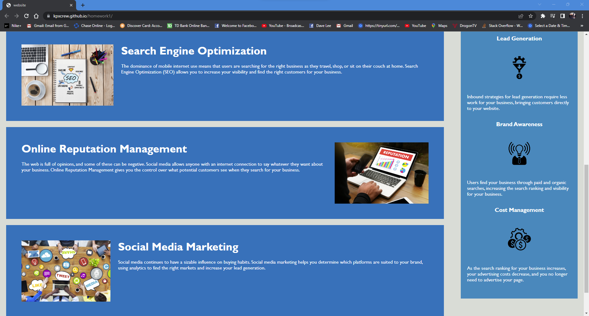

# Horiseon Website Project
The Horiseon Website Project is a website designed to provide information regarding the benefits of utilizing certain assets in respect to the internet.  The site is a demonstration of HTML and CSS 

By David Lee


## Technologies Used
HTML
CSS

## User Story

```
AS A marketing agency
I WANT a codebase that follows accessibility standards
SO THAT our own site is optimized for search engines
```

## Acceptance Criteria

```
GIVEN a webpage meets accessibility standards
WHEN I view the source code
THEN I find semantic HTML elements*
WHEN I view the structure of the HTML elements
THEN I find that the elements follow a logical structure independent of styling and positioning
WHEN I view the icon and image elements
THEN I find accessible alt attributes*
WHEN I view the heading attributes
THEN they fall in sequential order*
WHEN I view the title element
THEN I find a concise, descriptive title*
```

## About
The Horiseon project is a demonstration site that showcases HTML and CSS. The site has a navigation bar at the top that showcase three specific topics when it comes to growing a business utilizing internet properties.   

HTML was used so that a site can be created. CSS was used to style the HTML since CSS essentially dictates how the HTML elements are to be displayed on a site.  

The problems I faced was understanding proper HTML semantics and the purpose of using more specific elements rather than a general element. I also experienced many typos, mainly having closed brackets and curly brackets.  


## Usage
Utilizing the site is simple! 

Load the site by copying and pasting the link on to a browser.
* https://kpxcrew.github.io/homework1/

Once open, click on any of the three topics in the navigation bar. The title will redirect you to the location on the page that porvides more information in respect to the subject. 

## Screenshots




## Sources
https://www.w3schools.com/html
* This site taught me proper HTML coding and semantics. 

https://stackoverflow.com/questions/31038035/is-it-possible-to-combine-classes-in-css
* This site had taught me how to properly consolidate CSS class

https://www.freecodecamp.org/news/how-to-write-a-good-readme-file/
* This site has good information on what a proper README should include.

